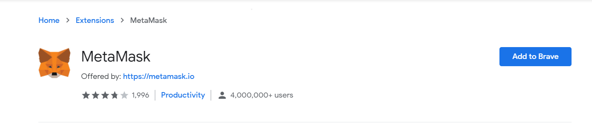
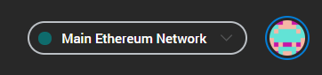
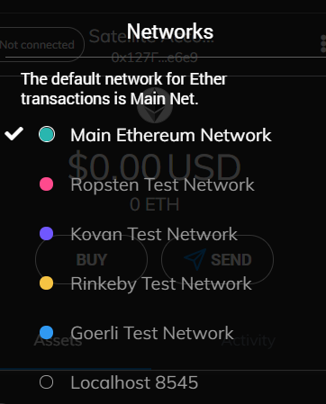
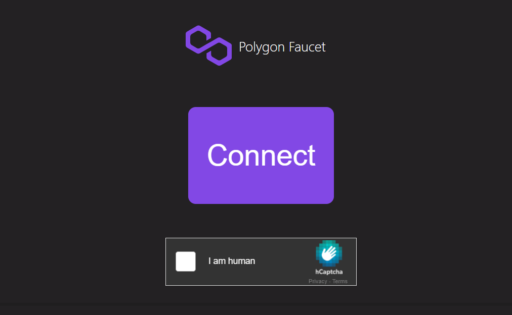
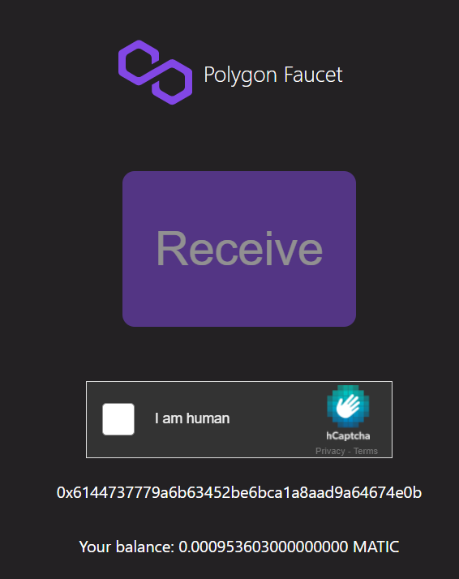
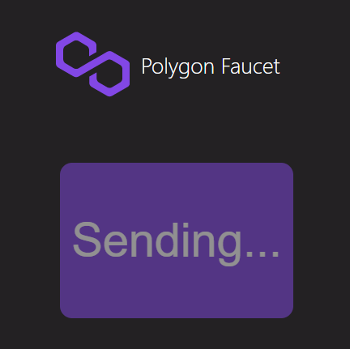
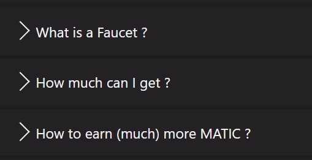

# ROUND 1 WALKTHROUGH
###### (Submissions for round 1 is closed)
- [ ]  Install MetaMask extension ([https://metamask.io/download](https://metamask.io/download))
- [ ]  Set up your private keys and wallet provider (MetaMask)
- [ ]  Connect to Mainnet Polygon ([https://docs.matic.network/docs/develop/metamask/config-matic/](https://docs.matic.network/docs/develop/metamask/config-matic/))
- [ ]  Get 0.0005 MATIC from Faucet ([https://matic.supply/](https://matic.supply/))
- [ ]  Check Block Explorer for transaction confirmation
- [ ]  Go to NFT Minter ([https://mintnft.today/](https://mintnft.today/)) and mint your first NFT
- [ ]  Check Block explorer again
- [ ]  Go to OpenSea and view your freshly minted NFT. ( [https://opensea.io/](https://opensea.io/) )

## Install MetaMask extension (https://metamask.io/download)

Go to the above mentioned link and click 'Download', you will be redirected to Chrome Web Store, where you will be able to download the MetaMask extension.
MetaMask is a digital crypto wallet which lives on your browser. It is an extension for accessing Ethereum enabled distributed applications, or "dApps" in your browser! MetaMask also lets the user create and manage their own identities, so when a dApp wants to perform a transaction and write to the blockchain, the user gets a secure interface to review the transaction, before approving or rejecting it.

## Set up your private keys and wallet provider (MetaMask)
Once your extension is installed, you will be greeted to a new page from MetaMask which guides you through setting up your wallet and private keys. (DO NOT SHARE YOUR PRIVATE KEYS OR SEED PHRASE ANYWHERE). 
You will be able to see your Public Ethereum address and your account balance (currently 0 ETH) once you successfully set up your wallet.

## Connect to Mainnet Polygon  (https://docs.matic.network/docs/develop/metamask/config-matic/)
Now that you've set up your wallet, you may notice that you are currently on the "Main Ethereum Network"

For this challenge we are not using the Ethereum Network (due to high transaction fees) but a Layer 2 sidechain of Ethereum called Polygon (previously Matic). 
To start using Polygon, we must first connect to its network, but MetaMask does not have Polygon Network in its "Networks" list by default (click on the dropdown to see the available networks), so we need to add it manually.

First, go to the above [mentioned link](https://docs.matic.network/docs/develop/metamask/config-matic/) and toggle to Matic Mainnet section, and follow the instructions provided there to connect to Polygon. Its just a few steps. Don't worry it is easy 😇.

## Get free MATIC from a Mainnet faucet (https://matic.supply/)
Awesome! you have added Polygon/Matic Mainnet to your network list. Now make sure you're connected to Polygon Mainnet for the next step. 

Go to Matic Supply, which is a mainnet faucet, that provides you with 0.0005 MATIC for free, so that you can get started with transacting on the network. 

***Note: This MATIC is on the mainnet, and is crowdfunded by people, so that beginner's like you can discover and use Polygon for free. Remember that these MATIC have real world value and are NOT test-tokens. Tokens on Testnets have no value, but on the Mainnet, that is not the case. So if you get any substantial amount of MATIC in the future, please remember to donate and support the faucet, so that more people can use Web3.***

Once you land on matic.supply, click on the "Connect" button. MetaMask will popup (if it does not, just manually open the MetaMask extension, or reload the page), and it will ask you to give permission to connect to the site. Approve it. (In the backend you just gave your digital signature saying that you want to connect and potentially use this application.)

Once you connect your wallet, complete the Captcha, and click "Receive" and you will be able to see a transaction-approved popup notification. 

Feel free to read the FAQs on the site, or else move on to the next step.

